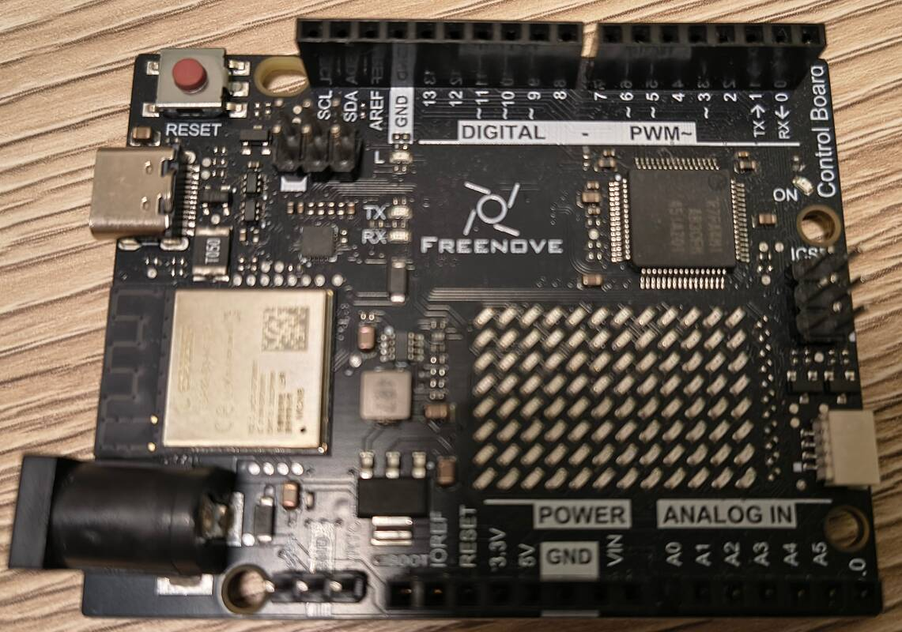

# Arduino UNO R4

## Freenove Control Board V3 WiFi

Kein Original Arduino, sondern ein Clone
[Freenove](https://store.freenove.com/products/fnk0096)

Blick auf den µController

Achtung: Die 3x2 Stiftleiste rechts ist mit "ICSP" (In-Circuit Serial Programming)
beschriftet, aber es ist eine SPI Schbnittstelle (Serial Peripheral Interface).
Die Beschriftung auf dem Board ist falsch, wie auch bei einigen
älteren Arduino UNO R4 Boards.
Die neuen Boards sind korrekt beschriftet [Reddit R4 WiFi have SPI and not ICSP](https://www.reddit.com/r/arduino/comments/17ss3tm/r4_wifi_have_spi_and_not_icsp/)

## Controller

Microcontroller: Renesas RA4M1

- ein ARM Cortex-M4 Kern mit FPU (floating point unit)
    ARMv7E-M Architektur
    Thumb-2 Befehlssatz
- Takt 48 MHz
- Flash 256 kB
- EEPROM 8 kB
- RAM 32 kB
- Spannung 5V 

## USB Bridge

Microcontroller: ESP32-S3-MINI-1-N8

- zwei Xtensa LX7 Kerne
- Takt 240 MHz
- Flash 8 MB (über SPI verbunden)
- SRAM 512 kB
- WLAN 2,4 GHz, Bluetooth LE, 5, Mesh
- Spannung 3,3V

Der ESP32-S3 ist über zwei verschiedene Wege mit dem ARM Mikrocontroller verbunden:

- Interface-Baustein zwischen ARM und der USB Schnittstelle.
    verbunden mit SCI1 und SCI9 (Serial Control Interface, jeweils TX/RX) des ARM
- Programmierer und Debugger Interface zum ARM
    verbunden mit SWD (Serial Wire Debug, Leitungen SWD-CLK,SWD-DIO) des ARM

## Stromversorgung

Option: Netzteil 6-24 V über Hohlsteckerbuchse 

Ohne weitere Hardware reicht die Versorgung über die USB-C Schnittstelle.
Ich verwende einen aktiven USB-Hub.
