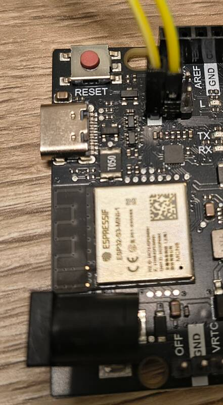

# Arduino UNO R4 USB-bridge

## Links

- [Github arduino/uno-r4-wifi-usb-bridge](https://github.com/arduino/uno-r4-wifi-usb-bridge)
- [Github arduino/uno-r4-wifi-usb-bridge/releases](https://github.com/arduino/uno-r4-wifi-usb-bridge/releases)

Die aktuelle Firmware Version ist 0.6.0 von Mai 2025 kann von Github geladen werden.
In dem Zip liegt auch ein espflash Programm.

Das aktuelle espflash Tool gibt es auf

- [Github esp-rs/espflash](https://github.com/esp-rs/espflash)
- [Github esp-rs/espflash](https://github.com/esp-rs/espflash/releases)

Dort liegt aktuell (Januar 2026) die Version 4.3.0 vom espflash Programm.

## Update der Firmware

Verwendetes System: Kubuntu 25.10

Auf dem Board muss zuerst eine Brücke zwischen den Pins GND-Download gesteckt werden.


Dann kann das Board über USB mit dem PC verbunden werden.
Das Board kann beim Flashen des ESP32 alleine über USB mit Strom versorgt werden.

Aus dem Release-Verzeichnis des Projekts die neuste Zip-Archivdatei laden.
Im tmp Verzeichnis entpacken.

```bash
cd /tmp
unzip ~/arduino-UNO-R4/local.downloads/unor4wifi-update-linux.zip 
```

Die Dateien aus dem Zip-Archiv werden im Unterverzeichnis `unor4wifi-update-linux` abgelegt.
Das Skript `update.sh` kann gestartet werden.
Im Skript wird das Programm `bin/espflash` aufgerufen.

Ein Blick auf die neue Version des espflash Programms:

```bash
unzip ~/arduino-UNO-R4/local.downloads/cargo-espflash-x86_64-unknown-linux-gnu.zip
./cargo-espflash espflash --help
```

Der Funktionsumfang der Version 4.3.0 ist größer.
Auch die Informationsausgabe über das Board ist umfangreicher

```bash
./cargo-espflash espflash board-info
```

```
[2026-01-10T18:29:01Z INFO ] Serial port: '/dev/ttyACM0'
[2026-01-10T18:29:01Z INFO ] Connecting...
[2026-01-10T18:29:02Z INFO ] Using flash stub
Chip type:         esp32s3 (revision v0.2)
Crystal frequency: 40 MHz
Flash size:        8MB
Features:          WiFi, BLE, Embedded Flash
MAC address:       b4:3a:45:b9:67:4c

Security Information:
=====================
Flags: 0x00000000 (0)
Key Purposes: [0, 0, 0, 0, 0, 0, 12]
Chip ID: 9
API Version: 0
Secure Boot: Disabled
Flash Encryption: Disabled
SPI Boot Crypt Count (SPI_BOOT_CRYPT_CNT): 0x0
```

Wird versucht die Information über das ESP32 Board abzurufen, ohne das
die Brücke GND-Download gesteckt, dann gibt es eine Fehlermeldung

```bash
./cargo-espflash espflash board-info
[2026-01-10T18:50:00Z INFO ] Serial port: '/dev/ttyACM0'
[2026-01-10T18:50:00Z INFO ] Connecting...
Error:   × Error while connecting to device
```

Mit der Version 4.3.0 vom espflash Programm die Firmware Version 0.6.0 in das
Flash des ESP32 schreiben.
Bei der Version 4.3.0 ist der Schalter `-b` für die Steuerung des before Resets.
Also `--baud` in dieser Version für die Datenrate verwenden.

```bash
./cargo-espflash espflash write-bin --baud 115200 0 unor4wifi-update-linux/firmware/UNOR4-WIFI-S3-0.6.0.bin 
```

```
[2026-01-10T18:39:28Z INFO ] Serial port: '/dev/ttyACM0'
[2026-01-10T18:39:28Z INFO ] Connecting...
[2026-01-10T18:39:28Z INFO ] Using flash stub
Chip type:         esp32s3 (revision v0.2)
Crystal frequency: 40 MHz
Flash size:        8MB
Features:          WiFi, BLE, Embedded Flash
MAC address:       b4:3a:45:b9:67:4c
[00:00:16] [========================================]     805/805     0x0      Verifying... OK!           [2026-01-10T18:39:45Z INFO ] Binary successfully written to flash!
```


## OpenOCD

Eine Software auf dem PC zum Verbinden mit dem On-Chip-Debugger des ARM Mikrocontrollers
ist Open On-Chip Debugger: [OpenOCD](https://openocd.org/).
Für das Debuggen kann der GDB über OpenOCD mit dem Mikrocontroller verbunden werden.

Aktuelle (Januar 2026) ist auf der Webseite die Version 0.12.0.
Diese Version ist auch in den Ubuntu Paketen. Also direkt mit `apt` installieren:

```bash
apt install openocd
```

Auf dem Arduino UNO R4 realisiert der ESP32 die Schnittstelle zwischen
USB-C Port und dem OCD des ARM M-4 Mikrocontrollers. Die Implementierung
ist ARM CMSIS-DAP (Coresight Microcontroller Software Interface
Standard - Debug Access Port) kompatibel.
[Github ARM-software CMSIS-DAP](https://github.com/ARM-software/CMSIS-DAP)

Die Konfigurationsdatei für das Interface (ESP32) und das Target (Renesas RA4M1)
auf dem Board findet sich in einem Repository von Arduino:

[arduino openOCD config](https://github.com/arduino/ArduinoCore-renesas/blob/main/variants/UNOWIFIR4/openocd.cfg)

OpenOCD liest Benutzer eigene Konfigurationsdateien aus `~/.config/openocd`.
Die Konfigurationsdatei lege ich dort unter `arduinoUnoR4.cfg` ab.

OpenOCD kann als gdbserver arbeiten.
Zum Debuggen des Codes auf dem ARM Cortex-4M mit dem gdb (GNU debugger) auf dem x86 PC installieren
```bash
apt install gdb-multiarch
```

Für die Arbeit mit Binary-Files die binutils für ARM Cortex-M und Cortex-R installieren.
```bash
apt install binutils-arm-none-eabi
```

